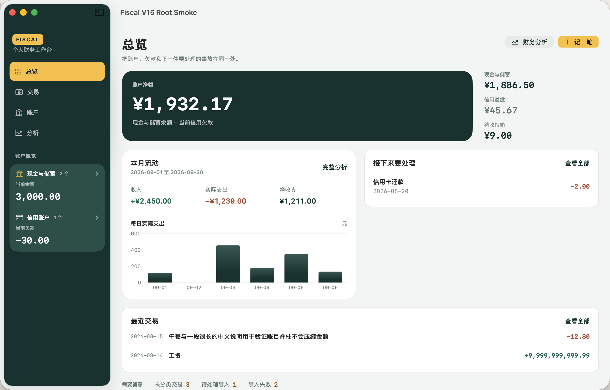

# V2.2.0 build 40 · Review 修复与回归

2026-09-06（Asia/Shanghai）。按用户授权修复原 Review 的 R1–R9 与 D1。**R1–R9 与 D1 已修复并完成针对性复核。** 未提交、推送、发布或替换正式 App。

## 修复内容

| 项目 | 修正 | 对应验证 |
| --- | --- | --- |
| R1 根数据刷新 | Mac 从可变模块离开、切换回总览/交易/账户时重新读取根事实、全局最近交易及账户引用；引用失败不清除有效账户上下文 | 隔离服务返回变化后的金额与账户名，直接回总览/账户；既有详情经分析页往返保持选择 |
| R2 Mac 最近交易 | 使用独立全账本模型；点击行带交易 ID 打开详情，并退出旧账户限定 | 选择第五个空账户后回总览仍有全局交易，点击第二笔打开该笔详情 |
| R3 iOS 重复导航 | 新导航意图带唯一 token；与保留上下文的数据刷新分开；选择在异步读取前确定，模型 generation 继续防止旧请求覆盖 | 先访问交易 Tab，再依次打开第二笔、第一笔、重复第一笔 |
| R4 Mac 待办 | 总览行显示核验中、失败原因与重试；记录真实来源，专项页及“查看全部未来事项”均返回原空间 | 核验先失败再成功，检查返回总览；追加全部事项返回检查 |
| R5 Mac 账户状态 | 分别展示加载、失败与重试、真实零账户、成功后的搜索无结果 | 失败后重试取得账户，零账户显示添加入口 |
| R6 iOS 空交易 | 显式处理 `.empty`，只在未开始/读取中显示骨架 | 空账本展示空态；失败重试恢复最近交易 |
| R7 iOS 分类 | 同步读取账户/分类引用；加载期间保留日期，引用失败显示降级说明与重试 | 餐饮、未分类和读取错误分别验证 |
| R8 iOS 大字体 | 辅助功能尺寸下标题与金额分行，标题可换行；金额使用有完整语音标签的水平滚动区域 | AX5 将整行滚到创建栏上方，检查完整金额、两端滚动截图和四 Tab 可达 |
| R9 Mac 离线说明 | 总览展示快照时间、离线只读、待同步数量及未计入当前金额的说明，核验可直达待同步页 | 隔离离线+待同步组合场景 |
| D1 总览优先级 | 压缩顶部摘要，趋势与待办并列；窄布局优先待办，缩短总览图表使最近交易获得更多首屏空间 | 1280×820 明/暗、1000 点窄窗口实拍与首屏待办可点击断言 |

## 方法和边界

- 新增 8 个回归用例（iOS 3、Mac 5），复用现有正式工作区 RootSmoke。测试数据是隔离只读 fixture，账户名与金额刷新验证不向正式账本写入。
- 本轮保留原有领域写入与金额计算规则、Backend/API/migration；仅修复阅读、导航、状态和布局。首屏数据来自现有 facts 和同 revision 月报。
- 第一轮 Mac 两个用例查找静态文字失败；结果附件中实际账户按钮和净额 value 均已显示正确数据。已用准确原生控件与 value 断言修正定位。一次宽泛 value 查询导致 XCTest 查询挂起，该次主动中止，未计为通过；已清理该次 402.6 MiB 的诊断包并保留日志。
- 六个受保护 scheme 字节保持原始 SHA-256；复用既有 DerivedData、ModuleCache 与 iPhone 17 Pro / iOS 26.5，串行 jobs=2，未新增模拟器或 runtime。
- 本轮是原 Review 发现的针对性修复与主会话复核，不冒充另一次独立 Reviewer 全量审查。iOS 26.0 最低版本继续由 API 可用性与 App target 编译检查，实际 UI 测试使用已有 26.5 runtime。

## 最终验证

- 完整 FiscalKitTests：**408 / 408，39 组，46.734 秒**。
- 本轮通过 **11 个不同 UI 用例**，其中新增回归 **8 个**；连同保留的 Build 阶段证据，V2.2.0 共 43 个不同 UI 用例取得通过结果。不是把本轮当作 43 个全部重跑。
- 最终 Mac 5 项与 iOS 4 项的回归组均零失败；另补跑 Mac 待办与全部事项返回共 1 项，通过。R2/R9 的通过证据来自首轮 Mac 组中的对应通过用例，未把同组失败项计为通过。
- 正式 App target：FiscaliOS 的 Release / generic iOS Simulator arm64、FiscalmacOS 的 Debug / macOS 均构建成功；产物均为 **2.2.0（40）**，最低 OS **26.0**。
- 六个 scheme SHA-256 与原始保护副本一致。既有模拟器 UUID 未变；当前名称“主模拟器”，机型 iPhone 17 Pro，iOS 26.5。
- DerivedData 约 **3.0 GiB**、ModuleCache **2.4 GiB**，磁盘剩余约 **53.7 GiB**。未增加模拟器/runtime，未清理用户其他缓存。
- 原始来源、命令、日志 SHA-256 和逐用例归属见 [VALIDATION.json](VALIDATION.json)；修复后 51 个 App 文件指纹及相对原 Review 的 8 个变动文件见 [fix-source-manifest.json](fix-source-manifest.json)。双端根的账户状态、列表空态、引用读取和刷新调用已按相同模式交叉检查。

## 实际界面

截图均为隔离合成数据。Mac 待办与最近交易已回到主阅读顺序；大字体金额以水平滚动读取完整数字，不再用省略号丢失尾数。

[Mac 深色](screenshots/fix-mac-overview-dark.png) · [Mac 窄窗口](screenshots/fix-mac-overview-narrow.png) · [离线与待同步](screenshots/fix-mac-overview-offline.png) · [iPhone 总览](screenshots/fix-ios-overview-light.png) · [真实空账本](screenshots/fix-ios-recent-empty.png) · [AX5 金额开头](screenshots/fix-ios-recent-ax5.png) · [AX5 金额末尾](screenshots/fix-ios-recent-ax5-amount-end.png)

新截图保留 `fix-` 前缀，修复前截图不覆盖；逐图来源和 hash 见 [PROVENANCE.json](screenshots/PROVENANCE.json)。
